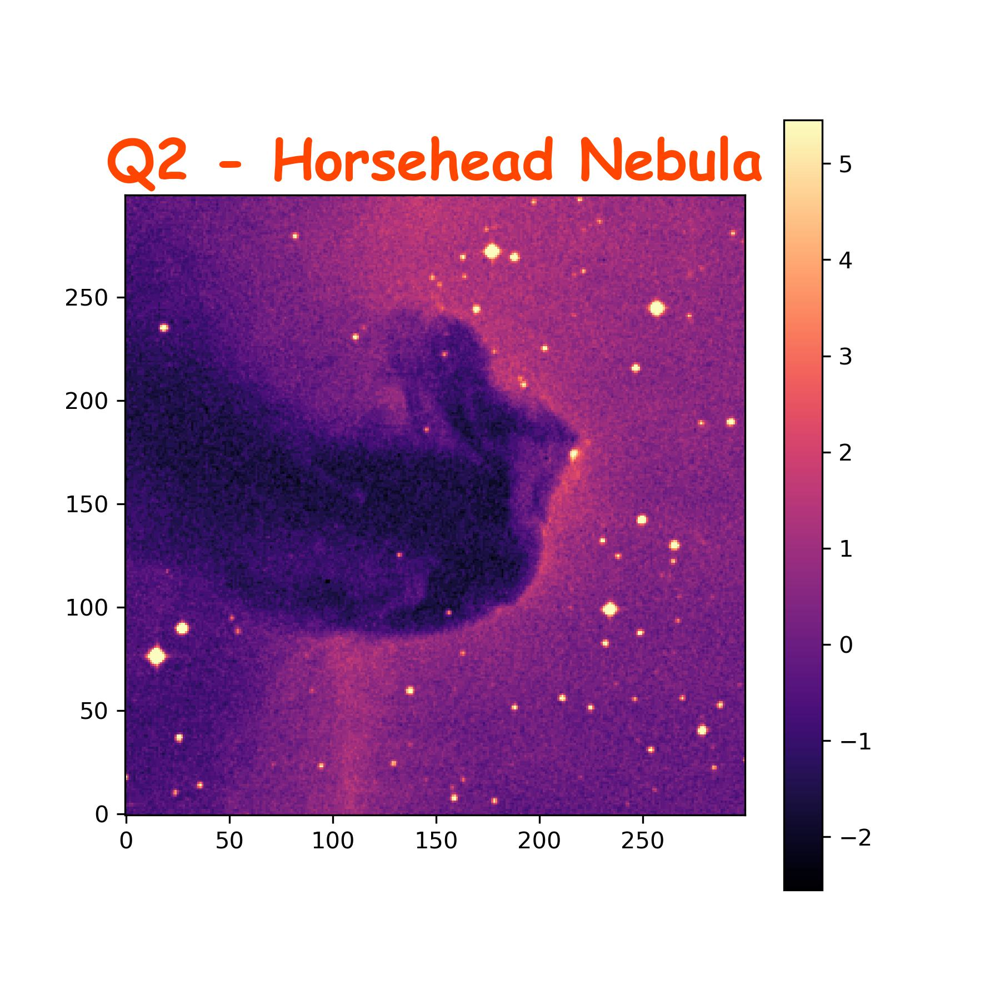
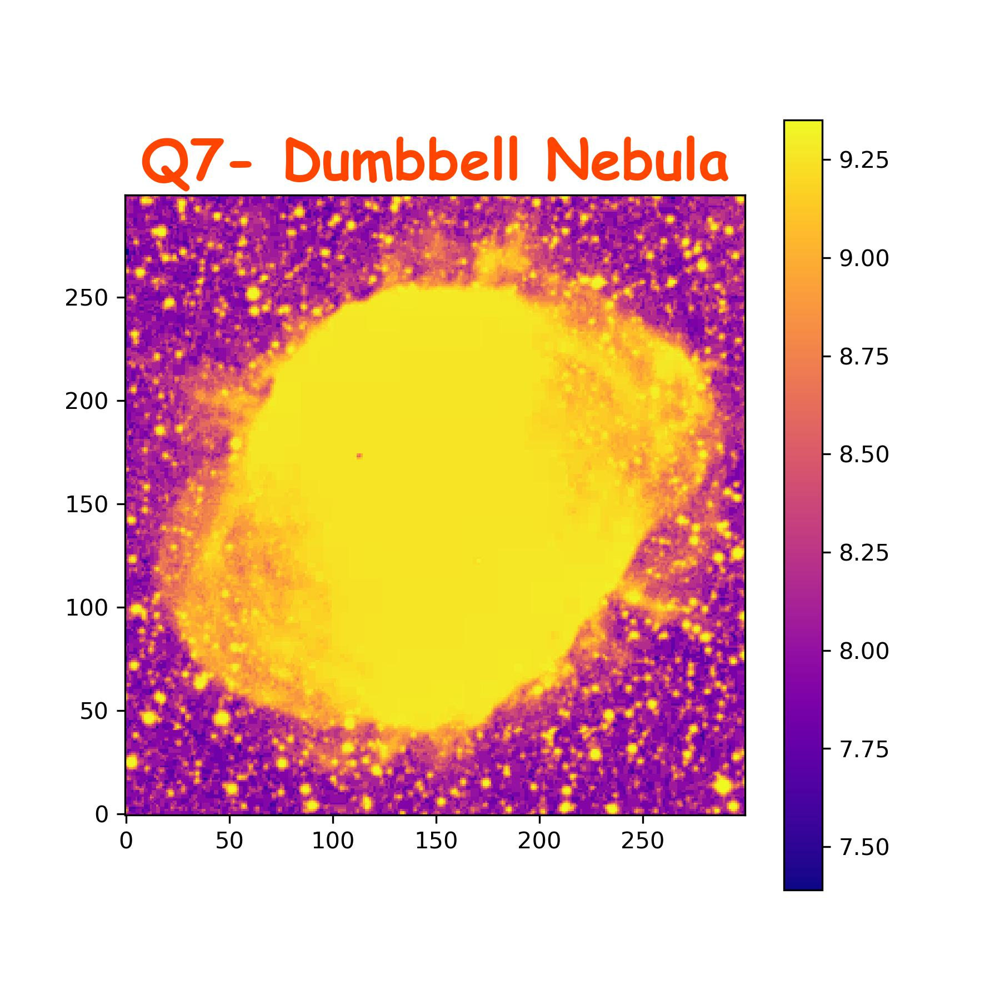
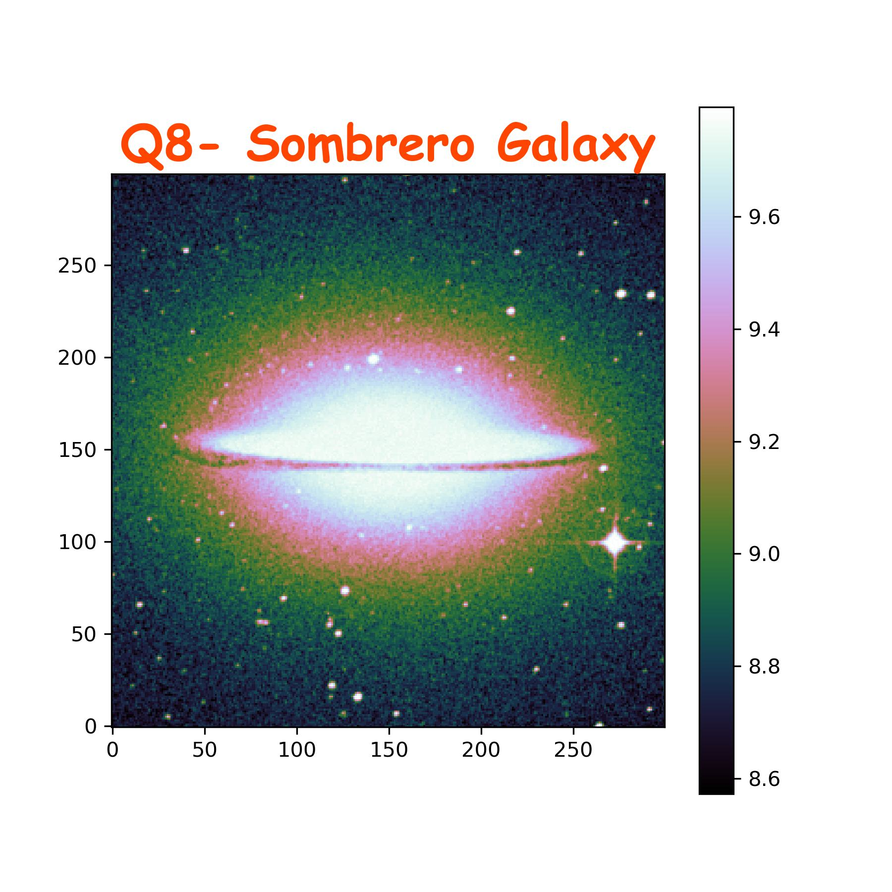
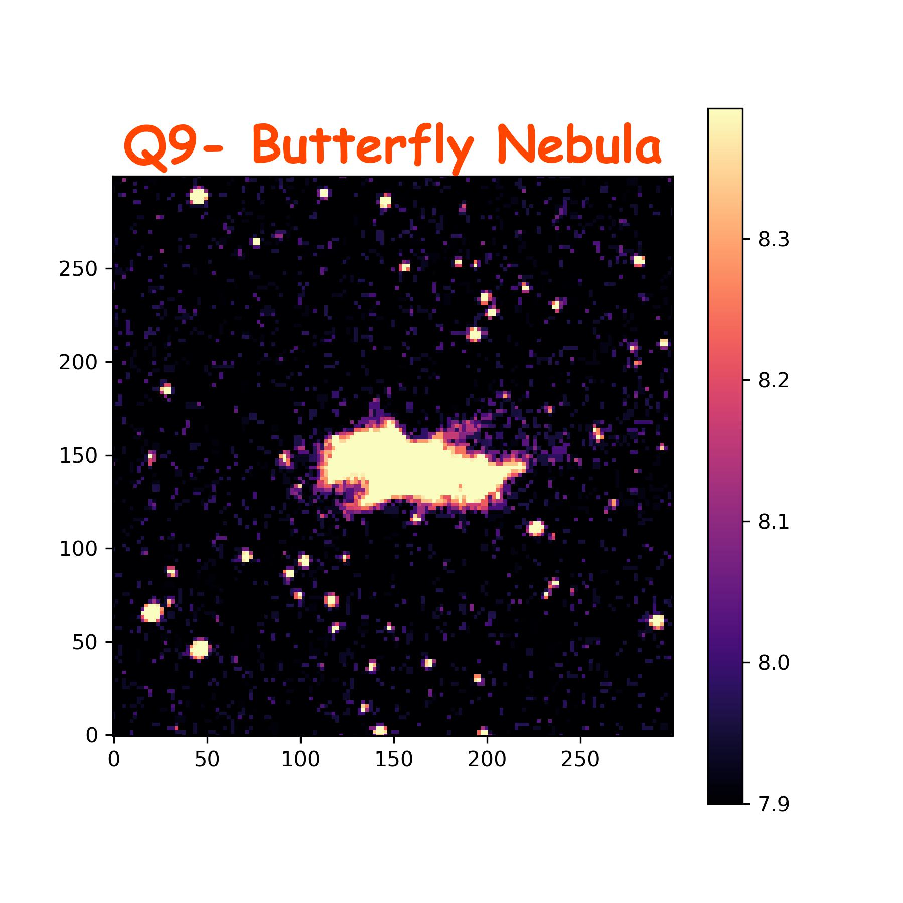
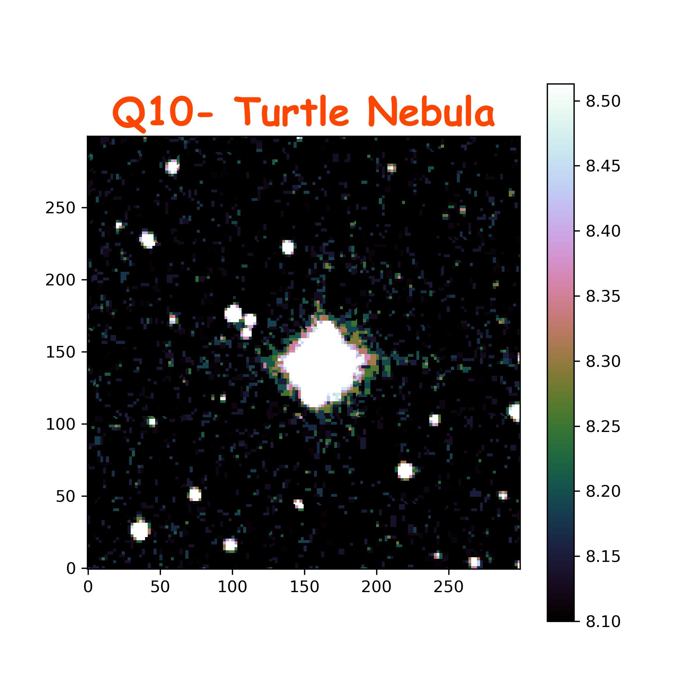

# Describing the FITS Files plotted

## Q1)

- **Name:** NGC 6611
- **Type:** Open Star Cluster within Nebula
- **Astrophysical significance:** This image shows NGC 6611, which is an open star cluster within the extremely famous Eagle Nebulae M16, famous from the 'Pillars of Creation' photograph

## Q2)

- **Name:** Horsehead Nebula (B33)
- **Type:** Dark Nebula
- **Astrophysical significance:** This image shows Barnard 33 or B33 called the Horsehead Nebula, famous for having a horsehead-like appearance, making it one of the most identifiable nebulae

## Q3)

- **Name:** The Crab Nebula (M1)
- **Type:** Supernova Remnant Nebula
- **Astrophysical significance:** This image shows M1/NGC 1952, the Crab Nebula, which is the remnant of a massive star that exploded as a supernova. There's a pulsar (rapidly spinning neutron star in the center of the crab nebula)

## Q4)

- **Name:** Orion Nebula (M42/ NGC 1976) (M43 also in pic)
- **Type:** Emission Nebulae + Star Nursery
- **Astrophysical significance:** This image shows the orion nebula, one of the brightest nebulae. Both M42 and M43 nebulae are seen in the pic along with a beautiful star nursery

## Q5)

- **Name:** Ring Nebula (M57) + IC 1296 (galaxy)
- **Type:** Planetary Nebula
- **Astrophysical significance:** This image shows the ring nebula, with a classic ring shape. You can also see the IC 1296 galaxy in the pic, but interestingly, the galaxy is actually very far away compared to the ring nebula, just happens to be seen in this line of sight

## Q6)

- **Name:** Whirlpool galaxy (M51a/ NGC 5194) + NGC 5195
- **Type:** Spiral Galaxy + its companion
- **Astrophysical significance:** This image shows the extremely beautiful and famous whirlpool galaxy of M51. It is a spiral galaxy, paired to NGC 5195, its companion galaxy. There's a supermassive blackhole in the center of the whirlpool galaxy.

## Q7)

- **Name:** Dumbbell Nebula/ Apple Core Nebula (M27/NGC 6853)
- **Type:** Planetary Nebula
- **Astrophysical significance:** This image shows the beautiful Dumbbell Nebula or Apple Core nebula (M27). It was the first planetary nebula, discovered by Charles Messier. It has a distinct dumbbell or apple core shape.

## Q8)

- **Name:** Sombrero Galaxy (M104)
- **Type:** Galaxy
- **Astrophysical significance:** This image shows the Sombrero Galaxy (M104). This galaxy has a sombrero-like appearance when we see it nearly edge-on because of its dark prominent dust lanes. It has a supermassive blackhole in its center.

## Q9)

- **Name:** Butterfly Nebula (NGC 6302)
- **Type:** Bipolar Planetary Nebula
- **Astrophysical significance:** This image shows the Butterfly Nebula also called the Bug Nebula or Caldwell 69 (NGC 6302). This nebula has a very cool butterfly-wing structure, which is one of the most complex structures out of any planetary nebulae.

## Q10)

- **Name:** Turtle Nebula (NGC 6210)
- **Type:** Planetary Nebula
- **Astrophysical significance:** This image shows the turtle nebula (NGC 6210) that lies in the constellation Hercules, somewhat shaped like a turtle, from which it gets its name.
