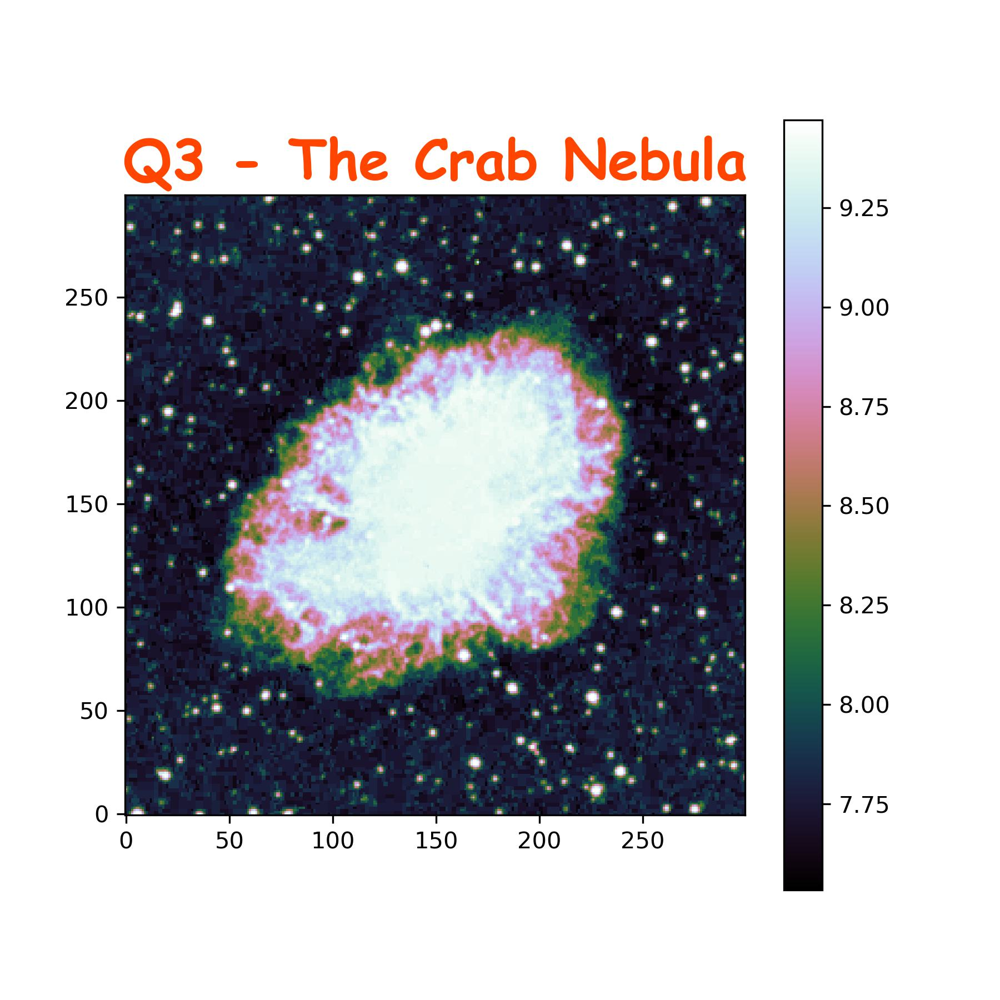

# Describing the FITS Files plotted

## Q1)

- **Name:** NGC 6611
- **Type:** Open Star Cluster within Nebula
- **Astrophysical significance:** This image shows NGC 6611, which is an open star cluster within the extremely famous Eagle Nebulae M16, famous from the 'Pillars of Creation' photograph

## Q2)

- **Name:** Horsehead Nebula (B33)
- **Type:** Dark Nebula
- **Astrophysical significance:** This image shows Barnard 33 or B33 called the Horsehead Nebula, famous for having a horsehead-like appearance, making it one of the most identifiable nebulae

## Q3)

- **Name:** The Crab Nebula (M1)
- **Type:** Supernova Remnant Nebula
- **Astrophysical significance:** This image shows M1/NGC 1952, the Crab Nebula, which is the remnant of a massive star that exploded as a supernova. There's a pulsar (rapidly spinning neutron star in the center of the crab nebula)
